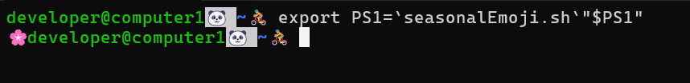

## TL:DR

1. 以下のシェルスクリプトを`/usr/local/bin`に配置

   ```bash:seasonalEmoji.sh
   #!/bin/bash

   SEASON_EMOJIS=(
     '\U1F38D'  # 🎍
     '\U1F36B'  # 🍫
     '\U1F38E'  # 🎎
     '\U1F338'  # 🌸
     '\U1F38F'  # 🎏
     '\U2614'   # ☔
     '\U1F320'  # 🌠
     '\U1F31E'  # 🌞
     '\U1F3BE'  # 🎾
     '\U1F47B'  # 👻
     '\U1F342'  # 🍂
     '\U1F385'  # 🎅
   )

   monthStr=`date +%m`
   monthNum=`echo $(( 10#$monthStr ))`

   echo -en ${SEASON_EMOJIS[$[${monthNum}-1]]}
   ```

1. <code>export PS1=\`seasonalEmoji.sh\`"$PS1"</code>を実行することでプロンプトの先頭に月毎に変わる文字が追加されるようになります。(以下の画像では、記事執筆時点の 4 月に対応する桜が表示されるようになっています)

   

1. もし、次回ターミナル起動時にも上記の設定が反映されて欲しければ、`.bashrc`に 2 で実行したコマンドを追記してください。

1. シェルスクリプトを改変して使って頂いてもかまいません

## 前提

- 絵文字を出力可能な terminal 環境であること
- シェルは bash であること（動くかもしれないですが他のシェルでは動作確認していません）

## 解説

### プロンプト（コマンドラインの先頭に表示される文字列）を変更するには

### PS1 変数に設定する文字列の仕様
