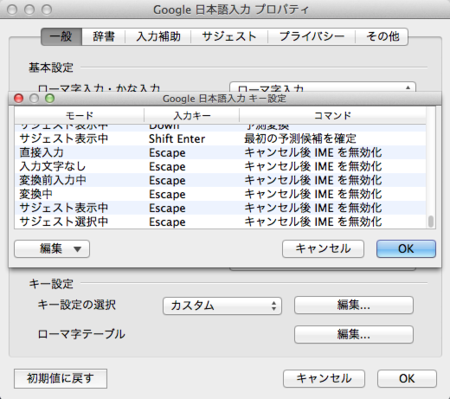

# Vimで日本語入力を快適に行うための設定

- Google日本語入力をインストールし以下の設定に変更する(画像の入力キーがEscapeの項目を全て追加する)

## 参考文献

[SSHを介してVimを使う人に感動的なESCキーを押すとESCキーが効きつつIMEがオフになる設定(Google日本語入力とVimの相性は最強！)](https://sifue.hatenablog.com/entry/20120411/1334161078)